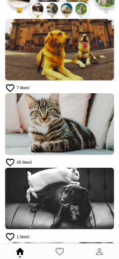

# Petgram Client 🐈

Petgram app integrated with Petgram-API

[Show the app](https://petgram.sotodario3.now.sh/)

## How works?

* `npm install` to install dependencies.
* `npm run dev || npm run serve:dev` to dev environment.
* `npm run lint` to run linter.

## License

MIT
